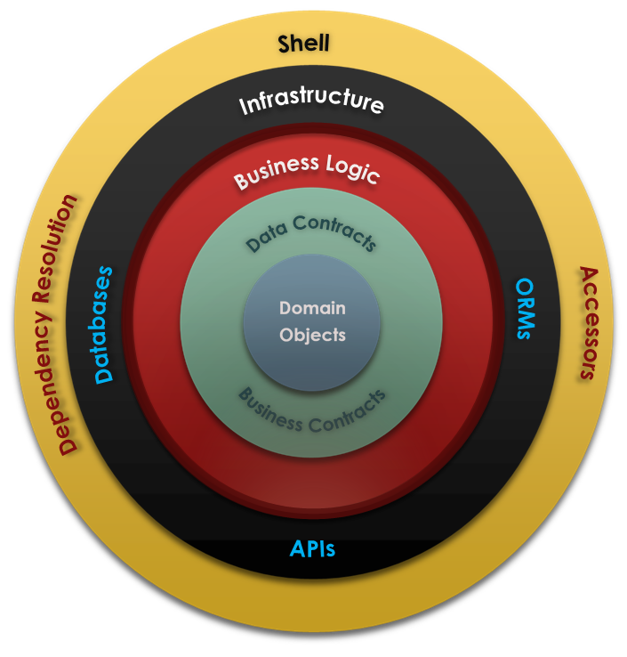

Steps to Follow
====
- Fire up the Back End Solution.
  - Go to the **Puzzle.API** project
    - Find it at **02 Service/03 Shell/02 API** folder inside the solution
    - Open up the **Properties** of the project
    - In the **Debug** tab, under **Start Options** add the following to the **Command Line Arguments**:
      - "**--console**"
      - This is in order to run the service on the **console**, for testing purposes
      - The service is built to run in the **console**, as a **Windows Service**, or with a couple more files as an **Azure Worker** too
- Visit http://localhost:9000/PZL/swagger in order to have access to the API through a Swagger UI

FAQ
====

### What are the main **Architectural Patterns** followed?
- The Back End is composed of a Service which encapsulates the Data Access as well as the Business Logic
- Such service is actually a Microservice
- The Microservice is implemented using an **Onion Architecture**

- More information on Onion Architectures can be found at:
  - http://jeffreypalermo.com/blog/the-onion-architecture-part-1/

### What's the overall Project Layout?
.  
├── **Front End** ==> *Placeholder for Front End Project(s)*  
├── **Puzzle Services** ==> *Back End Service*  
├── **AssemblyInfo** ==> *Used to unify the whole service Versioning (not hooked up yet)*  
├── **Docs** ==> *Where relevant documentation about the service is placed*  
├── **Sources** ==> *Source Files*  
├────── **Commons** ==> *Commons Library is present here in order to avoid Private Nugets*  
├────── **Databases** ==> *.json and .xml files containing the data to be used for this project*  
├────── **Service** ==> *Code relevant to this solution*  

### What if one wanted to change where the data is coming from?
- As customary in Onion Architectures, the solution provides a set of Data Contracts (Interfaces) in order to access the data from the Business Logic
- If we wanted to handle data from a different source, we need only implement the Data Contracts and access the new data sources from there
- The current solution is plugged to the JSON files in the **Databases** folder, but just as easily it could plug to the XML files instead

### What's the deal with the InMemory database found in the **Infrastructure** folder?
- It's just **an** implementation of the common's data contracts which happens to work with objects in Memory
- This InMemory database was created to aid in testing

### Could we have several Data Sources at once?
- Absolutely. The data contracts have been implemented by the InMemory database and EF 6; but any technology can be used, as long as the contracts are implemented
- As a matter of fact, one could even choose live, per request or user, the data source one would use

### Why mark Domain Entity Fields as **virtual**?
- This allows for Interceptors to be used on the entities
- e.g.: Dirty Field Trackers

### What are the Projects within the **01 Solution Shared Libraries**?
- This are excerpts from a bigger *Commons Library* I built and use to develop services
- This commons library greatly facilitate my development lifecycle
- Each project within this sample library is actually published to its own Nuget. Any referencing project later on imports the Nugets it needs (and each one calls its own dependencies of course)
- In order to avoid seting up a Private Local Nuget Repo, or anything of that sort, the files have been copied here
- Each project has been trimmed, and only what was needed for this demo has been imported. This by no means represents the entirity of the library

Changes
====
- There were 2 entries for chyper #3 with Order Id = 8; 12 was missing. I changed the last ocurrance to 12.
- There were 2 entries for chyper #4 with Order Id = 12; 8 was missing. I changed the first ocurrance to 8.
